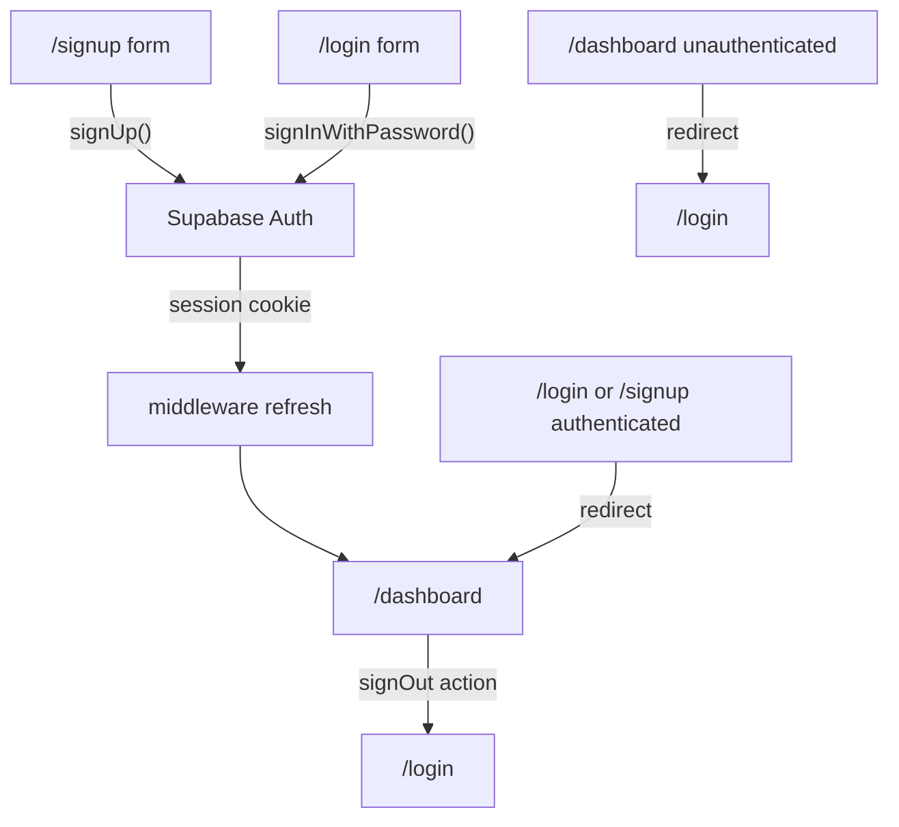

# Authentication

Email/password authentication via Supabase Auth. Session cookies are managed by `@supabase/ssr` with middleware refresh.

## Supabase Dashboard Setup

Configure these settings manually before testing auth locally.

### 1. API keys

**Project Settings → API**

| Dashboard value | Env var |
|-----------------|---------|
| Project URL | `NEXT_PUBLIC_SUPABASE_URL` |
| Publishable (anon) key | `NEXT_PUBLIC_SUPABASE_PUBLISHABLE_KEY` |

Copy [`.env.example`](../.env.example) to `.env.local` and fill in both values.

### 2. Email provider

**Authentication → Providers → Email**

- Enable the Email provider
- **Disable "Confirm email"** for local development — users can sign in immediately after sign-up
- For production, re-enable confirmation and configure SMTP under **Authentication → Email Templates**

### 3. URL configuration

**Authentication → URL Configuration**

| Setting | Local value |
|---------|-------------|
| Site URL | `http://localhost:3000` |
| Redirect URLs | `http://localhost:3000/**` |

Add your Vercel production URL when deploying.

## Auth Flow

## Routes

| Route | Access | Description |
|-------|--------|-------------|
| `/login` | Public | Sign in with email and password |
| `/signup` | Public | Create a new account |
| `/dashboard` | Protected | Requires authenticated session |

Wardrobe and outfit routes remain public placeholders until later milestones.

## Implementation

| File | Role |
|------|------|
| `src/lib/supabase/client.ts` | Browser client for login/sign-up forms |
| `src/lib/supabase/server.ts` | Server client for `getUser()` and sign-out |
| `src/lib/supabase/middleware.ts` | Session refresh and route protection |
| `src/lib/auth/actions.ts` | `signOut()` server action |
| `src/components/auth/LoginForm.tsx` | Client sign-in form |
| `src/components/auth/SignUpForm.tsx` | Client sign-up form |

## Security Notes

- Only `NEXT_PUBLIC_*` Supabase vars belong in client code
- Never expose the service role key in the browser
- Route protection uses middleware plus a server-side `getUser()` check on `/dashboard`
- Enable RLS on all data tables before storing user data (Milestone 2 database work)

## Manual Test Checklist

- [ ] Sign up with email/password → lands on `/dashboard`
- [ ] Sign out → redirected to `/login`; `/dashboard` redirects to `/login`
- [ ] Wrong password on login → error message, form re-enabled
- [ ] `/login` or `/signup` while signed in → redirects to `/dashboard`
- [ ] Nav shows Login + Sign up when logged out, Sign out when logged in
