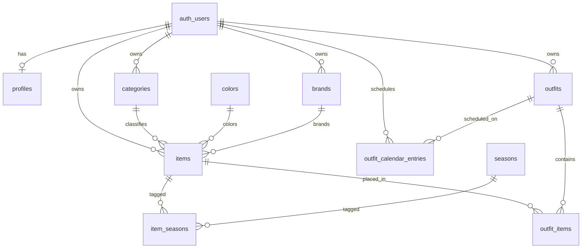

# Database Schema

PostgreSQL schema for Garde-robe on Supabase. Migrations live in [`supabase/migrations/`](../supabase/migrations/).

## Overview

- **Identity:** Supabase `auth.users` — no duplicate users table
- **Profiles:** thin `profiles` table keyed to `auth.users.id`
- **Lookups (hybrid):** user-scoped `categories` and `brands`; global seeded `colors` and `seasons`
- **Occasions:** free-form tags on `items.occasion_tags` (`text[]`)
- **Item types:** `clothing`, `accessory`, `jewelry` on `items.item_type`
- **Images:** `items.image_path` (original) and optional `processed_image_path` — see [storage.md](./storage.md) and [image-processing.md](./image-processing.md)



## Table List

| Table | Scope | Purpose |
|-------|-------|---------|
| `profiles` | per user | App-level user record linked to auth |
| `categories` | per user | Item classification (tops, shoes, etc.) |
| `colors` | global | Seeded color palette |
| `brands` | per user | User-defined brands |
| `seasons` | global | Seeded seasons for tagging |
| `items` | per user | Wardrobe items (clothing, accessories, jewelry) |
| `item_seasons` | junction | Many-to-many: items ↔ seasons |
| `outfits` | per user | Saved outfit compositions |
| `outfit_items` | junction | Items placed on outfit canvas |
| `outfit_calendar_entries` | per user | One outfit assigned per calendar day |

## Column Definitions

### `profiles`

| Column | Type | Constraints | Notes |
|--------|------|-------------|-------|
| `id` | `uuid` | PK, FK → `auth.users(id)` ON DELETE CASCADE | Same as auth user id |
| `currency_code` | `char(3)` | NOT NULL, default `'EUR'` | Profile default for formatting wardrobe value |
| `created_at` | `timestamptz` | NOT NULL, default `now()` | |
| `updated_at` | `timestamptz` | NOT NULL, default `now()` | |

### `categories`

| Column | Type | Constraints | Notes |
|--------|------|-------------|-------|
| `id` | `uuid` | PK, default `gen_random_uuid()` | |
| `user_id` | `uuid` | NOT NULL, FK → `auth.users(id)` ON DELETE CASCADE | |
| `name` | `text` | NOT NULL | e.g. tops, necklace |
| `item_type` | `text` | NOT NULL, CHECK (`clothing`, `accessory`, `jewelry`) | |
| `created_at` | `timestamptz` | NOT NULL, default `now()` | |
| | | UNIQUE (`user_id`, `name`, `item_type`) | |

### `colors`

| Column | Type | Constraints | Notes |
|--------|------|-------------|-------|
| `id` | `uuid` | PK, default `gen_random_uuid()` | |
| `name` | `text` | NOT NULL, UNIQUE | e.g. black, navy |
| `hex_code` | `text` | | Optional UI swatch |
| `sort_order` | `smallint` | NOT NULL, default `0` | Display order |

### `brands`

| Column | Type | Constraints | Notes |
|--------|------|-------------|-------|
| `id` | `uuid` | PK, default `gen_random_uuid()` | |
| `user_id` | `uuid` | NOT NULL, FK → `auth.users(id)` ON DELETE CASCADE | |
| `name` | `text` | NOT NULL | |
| `created_at` | `timestamptz` | NOT NULL, default `now()` | |
| | | UNIQUE (`user_id`, `name`) | |

### `seasons`

| Column | Type | Constraints | Notes |
|--------|------|-------------|-------|
| `id` | `uuid` | PK, default `gen_random_uuid()` | |
| `name` | `text` | NOT NULL, UNIQUE | spring, summer, etc. |
| `sort_order` | `smallint` | NOT NULL, default `0` | Display order |

### `items`

| Column | Type | Constraints | Notes |
|--------|------|-------------|-------|
| `id` | `uuid` | PK, default `gen_random_uuid()` | |
| `user_id` | `uuid` | NOT NULL, FK → `auth.users(id)` ON DELETE CASCADE | |
| `name` | `text` | NOT NULL | |
| `item_type` | `text` | NOT NULL, CHECK (`clothing`, `accessory`, `jewelry`) | |
| `category_id` | `uuid` | FK → `categories(id)` ON DELETE SET NULL | |
| `color_id` | `uuid` | FK → `colors(id)` ON DELETE SET NULL | |
| `brand_id` | `uuid` | FK → `brands(id)` ON DELETE SET NULL | |
| `occasion_tags` | `text[]` | NOT NULL, default `'{}'` | e.g. `{work,casual}` |
| `image_path` | `text` | | Original storage path: `{user_id}/{item_id}/original.{ext}` |
| `processed_image_path` | `text` | | Processed storage path: `{user_id}/{item_id}/processed.webp` |
| `remove_background` | `boolean` | NOT NULL, default `false` | Per-item opt-in for background removal |
| `image_processing_status` | `text` | NOT NULL, default `'none'`, CHECK (`none`, `pending`, `processing`, `completed`, `failed`) | Processing lifecycle |
| `image_processing_error` | `text` | | Last failure message |
| `image_processing_attempts` | `smallint` | NOT NULL, default `0` | Retry counter |
| `image_processing_updated_at` | `timestamptz` | | Last status change |
| `notes` | `text` | | Optional free text |
| `price` | `numeric(10,2)` | NULL, CHECK (`price >= 0`) | Optional purchase price |
| `currency_code` | `char(3)` | NULL | ISO 4217 code; defaults from profile on save |
| `created_at` | `timestamptz` | NOT NULL, default `now()` | |
| `updated_at` | `timestamptz` | NOT NULL, default `now()` | |

### `item_seasons`

| Column | Type | Constraints | Notes |
|--------|------|-------------|-------|
| `item_id` | `uuid` | PK (composite), FK → `items(id)` ON DELETE CASCADE | |
| `season_id` | `uuid` | PK (composite), FK → `seasons(id)` ON DELETE CASCADE | |

### `outfits`

| Column | Type | Constraints | Notes |
|--------|------|-------------|-------|
| `id` | `uuid` | PK, default `gen_random_uuid()` | |
| `user_id` | `uuid` | NOT NULL, FK → `auth.users(id)` ON DELETE CASCADE | |
| `name` | `text` | NOT NULL | |
| `notes` | `text` | NULL | Optional outfit description |
| `cover_image_url` | `text` | NULL | Optional thumbnail URL or storage path |
| `created_at` | `timestamptz` | NOT NULL, default `now()` | |
| `updated_at` | `timestamptz` | NOT NULL, default `now()` | |

### `outfit_items`

Maps to `CanvasItemPlacement` in [`src/lib/types/outfit.ts`](../src/lib/types/outfit.ts).

| Column | Type | Constraints | Notes |
|--------|------|-------------|-------|
| `id` | `uuid` | PK, default `gen_random_uuid()` | |
| `outfit_id` | `uuid` | NOT NULL, FK → `outfits(id)` ON DELETE CASCADE | |
| `item_id` | `uuid` | NOT NULL, FK → `items(id)` ON DELETE CASCADE | |
| `position_x` | `double precision` | NOT NULL, default `0` | Canvas x |
| `position_y` | `double precision` | NOT NULL, default `0` | Canvas y |
| `scale` | `double precision` | NOT NULL, default `1` | |
| `rotation` | `double precision` | NOT NULL, default `0` | Degrees |
| `z_index` | `integer` | NOT NULL, default `0` | Layer order |
| | | UNIQUE (`outfit_id`, `item_id`) | One placement per item per outfit |

### `outfit_calendar_entries`

One saved outfit per user per calendar day. See [v2-features.md](./v2-features.md).

| Column | Type | Constraints | Notes |
|--------|------|-------------|-------|
| `id` | `uuid` | PK, default `gen_random_uuid()` | |
| `user_id` | `uuid` | NOT NULL, FK → `auth.users(id)` ON DELETE CASCADE | |
| `outfit_id` | `uuid` | NOT NULL, FK → `outfits(id)` ON DELETE CASCADE | |
| `scheduled_date` | `date` | NOT NULL | Local calendar date (YYYY-MM-DD); maps to “date” in product terms |
| `occasion` | `text` | NULL | e.g. work, wedding |
| `notes` | `text` | NULL | Day-specific note |
| `created_at` | `timestamptz` | NOT NULL, default `now()` | |
| `updated_at` | `timestamptz` | NOT NULL, default `now()` | |
| | | UNIQUE (`user_id`, `scheduled_date`) | One outfit per day |

## Relationships

- **User ownership:** `profiles`, `categories`, `brands`, `items`, `outfits` all reference `auth.users(id)`
- **Item lookups:** `items` optionally references `categories`, `colors`, `brands`
- **Season tags:** `item_seasons` links `items` to global `seasons`
- **Outfit canvas:** `outfit_items` links `outfits` to `items` with position metadata
- **Calendar:** `outfit_calendar_entries` links a user’s saved outfit to a calendar date
- **Category consistency:** app layer should ensure `items.category_id` belongs to the same user (enforced via RLS on join, not FK)

## Indexing

| Index | Table | Columns | Purpose |
|-------|-------|---------|---------|
| `items_user_id_idx` | `items` | `user_id` | Wardrobe list |
| `items_user_id_item_type_idx` | `items` | `user_id`, `item_type` | Filter by type |
| `items_user_id_category_id_idx` | `items` | `user_id`, `category_id` | Filter by category |
| `items_user_id_color_id_idx` | `items` | `user_id`, `color_id` | Filter by color |
| `items_occasion_tags_gin_idx` | `items` | `occasion_tags` (GIN) | Overlap / contains filters |
| `categories_user_id_idx` | `categories` | `user_id` | User category lists |
| `brands_user_id_idx` | `brands` | `user_id` | User brand lists |
| `outfits_user_id_idx` | `outfits` | `user_id` | User outfit lists |
| `outfit_items_outfit_id_idx` | `outfit_items` | `outfit_id` | Load canvas items |
| `outfit_calendar_entries_user_id_idx` | `outfit_calendar_entries` | `user_id` | User calendar |
| `outfit_calendar_entries_user_id_scheduled_date_idx` | `outfit_calendar_entries` | `user_id`, `scheduled_date` | Month view queries |
| `item_seasons_season_id_idx` | `item_seasons` | `season_id` | Filter by season |

## Row Level Security

RLS is enabled on all app tables. Policies use `auth.uid()` from Supabase Auth.

| Table | Policy pattern |
|-------|----------------|
| `profiles` | User can CRUD own row (`id = auth.uid()`) |
| `categories`, `brands`, `items`, `outfits` | User can CRUD rows where `user_id = auth.uid()` |
| `item_seasons` | Access via item ownership; insert/delete require owning item |
| `outfit_items` | SELECT/UPDATE/DELETE via outfit ownership; INSERT requires both outfit and item belong to user |
| `outfit_calendar_entries` | User can CRUD rows where `user_id = auth.uid()`; outfit must belong to user |
| `colors`, `seasons` | SELECT for authenticated users; no writes (seed-only) |

**Profiles trigger:** new `auth.users` row auto-inserts a `profiles` row.

**Storage (Milestone 4):** bucket `item-images` with path prefix `{user_id}/` — see [storage.md](./storage.md).

**Image processing:** optional background removal columns on `items` — see [image-processing.md](./image-processing.md).

## Seed Data

**`colors`:** black, white, gray, beige, brown, navy, blue, green, red, pink, purple, multicolor

**`seasons`:** spring, summer, fall, winter, all-season

## Applying Migrations

```bash
# Supabase CLI (linked project)
supabase db push

# Or run each file in Supabase Dashboard → SQL Editor
```

Run migrations in order:

1. `20260313000001_initial_schema.sql`
2. `20260313000002_rls_policies.sql`
3. `20260313000003_storage.sql`
4. `20260314000004_image_processing.sql`
5. `20260315000005_v2_schema.sql` — price, profile currency, outfit metadata, calendar table + RLS
6. `20260315000007_v2_schema_extensions.sql` — optional; only if you applied the former split V2 migrations before consolidation

**Entity naming:** wardrobe items live in `items` (not `clothing_items`). Calendar rows live in `outfit_calendar_entries` (not `calendar_entries`). Row types: [`src/lib/types/database.ts`](../src/lib/types/database.ts).

**If you already applied the old split files** (`20260315000005_item_price.sql`, `20260315000006_outfit_calendar.sql`) in Supabase, skip re-running `005_v2_schema` and apply only `007_v2_schema_extensions.sql` in the SQL Editor.

## Future Extensions

- `occasions` table + junction if occasion taxonomy outgrows free text
- `wear_log` for "last worn" tracking
- Multi-currency conversion for wardrobe value totals
- `outfit_tags`, sharing flags on `outfits`
- `item_images` for multiple photos per item
- Full-text search on `items.name` / `notes`
- Service role key for admin scripts only — never in client code
