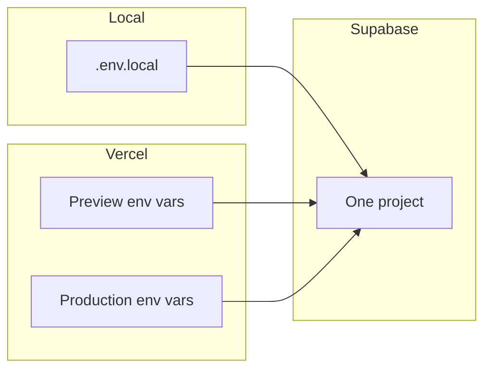

# Deployment

Deploy Garde-robe to [Vercel](https://vercel.com) with Supabase as the external backend (auth, database, storage). This guide covers environment variables, first deploy, and production checks.

Related docs: [auth.md](./auth.md), [storage.md](./storage.md), [database-schema.md](./database-schema.md).

## Overview

| Service | Role |
|---------|------|
| **Vercel** | Hosts the Next.js app (App Router, middleware, static assets) |
| **Supabase** | Auth, Postgres, Storage — stays outside Vercel |

No server-side secrets are required for the current MVP. The app only needs two **public** Supabase variables.

## Prerequisites

Before deploying:

1. **GitHub repo** with this project pushed to GitHub
2. **Supabase project** with migrations applied (see [Applying migrations](#apply-supabase-migrations))
3. **Vercel account** linked to GitHub

## Required environment variables

The app reads env vars through [`src/lib/env/public.ts`](../src/lib/env/public.ts). Only these two are required on Vercel:

| Variable | Required | Vercel environments | In browser bundle? | Where to find it |
|----------|----------|---------------------|--------------------|------------------|
| `NEXT_PUBLIC_SUPABASE_URL` | Yes | Production, Preview, Development | Yes (inlined at build) | Supabase → **Project Settings → API → Project URL** |
| `NEXT_PUBLIC_SUPABASE_PUBLISHABLE_KEY` | Yes | Production, Preview, Development | Yes (inlined at build) | Supabase → **Project Settings → API → Publishable key** (anon key) |

**Not used today — do not add unless you implement server-only admin features:**

| Variable | Notes |
|----------|-------|
| `SUPABASE_SERVICE_ROLE_KEY` | Bypasses RLS. Server-only, **never** use a `NEXT_PUBLIC_` prefix. Not needed for current features. |

If either required variable is missing at runtime, `getPublicEnv()` throws and auth, wardrobe, and outfits will fail.

## Local vs Preview vs Production

This project uses a **single Supabase project** for local, Preview, and Production. That keeps setup simple; Preview and Production share the same database and storage.

| Environment | Where vars are set | Typical app URL | Notes |
|-------------|-------------------|-----------------|-------|
| **Local** | `.env.local` in project root (gitignored) | `http://localhost:3000` | Copy [`.env.example`](../.env.example) → `.env.local` |
| **Preview** | Vercel → Project → Settings → Environment Variables (**Preview**) | `https://<branch>-<team>.vercel.app` | PR/branch deploys; same Supabase data as prod |
| **Production** | Vercel → Environment Variables (**Production**) | `https://your-app.vercel.app` | Live site; configure Supabase auth URLs for this domain |



**Tradeoff:** Preview deploys use real data. Fine for solo development; use caution if others test on preview URLs.

## Setting variables in Vercel

1. Open your project on [vercel.com](https://vercel.com)
2. Go to **Settings → Environment Variables**
3. Add each variable:

   **Name:** `NEXT_PUBLIC_SUPABASE_URL`  
   **Value:** your Supabase project URL (e.g. `https://xxxxx.supabase.co`)  
   **Environments:** check Production, Preview, and Development

4. Repeat for `NEXT_PUBLIC_SUPABASE_PUBLISHABLE_KEY` with the publishable (anon) key

5. **Redeploy** after adding or changing variables (see below)

### Vercel best practices

- Use the **exact same names** as local (`.env.example`) — do not rename
- The publishable key is **public by design**; security comes from **Row Level Security (RLS)**, not hiding the anon key
- Do **not** prefix secrets with `NEXT_PUBLIC_` — anything with that prefix is embedded in the client JavaScript bundle
- Optional: use **Development** environment vars if you run `vercel dev` locally

## Redeploy after changing env vars

`NEXT_PUBLIC_*` variables are **inlined at build time**. Changing them in the Vercel dashboard does not affect already-built deployments until you redeploy.

After editing environment variables:

1. Go to **Deployments**
2. Open the **⋯** menu on the latest deployment
3. Choose **Redeploy**
4. Or push a new commit to trigger a fresh build

Preview and Production have separate env scopes — update both if needed, then redeploy each.

## How to avoid exposing secrets

| Do | Don't |
|----|-------|
| Put Supabase URL and publishable key in Vercel env vars | Commit `.env.local` or real keys to Git |
| Use the **publishable (anon)** key in Vercel | Put the **service role / secret** key in Vercel client env or `NEXT_PUBLIC_*` |
| Keep secrets in server-only code without `NEXT_PUBLIC_` (future) | Import service role keys in `"use client"` components |
| Rely on RLS for data isolation | Disable RLS in production |

Local secrets live in `.env.local`. The repo `.gitignore` excludes `.env*` — never force-add files containing real keys.

Implementation detail: [`publicEnvValues`](../src/lib/env/public.ts) uses static `process.env.NEXT_PUBLIC_*` access so Next.js can inline them correctly in the browser bundle.

## Apply Supabase migrations

Run all migrations in order before first production use:

1. `20260313000001_initial_schema.sql`
2. `20260313000002_rls_policies.sql`
3. `20260313000003_storage.sql`
4. `20260314000004_image_processing.sql`

Via Supabase CLI (linked project):

```bash
supabase db push
```

Or paste each file into **Supabase Dashboard → SQL Editor**.

See [database-schema.md](./database-schema.md) for table details.

## Supabase production configuration

### Auth URL configuration

**Authentication → URL Configuration**

| Setting | Production example | Preview (optional) |
|---------|-------------------|-------------------|
| Site URL | `https://your-app.vercel.app` | Can match production or a preview URL |
| Redirect URLs | `https://your-app.vercel.app/**` | `https://*.vercel.app/**` |

Without redirect URLs, sign-in and sign-up may fail or redirect incorrectly. See [auth.md](./auth.md) for local values.

### Email (production)

For production you may want to **enable email confirmation** and configure SMTP under **Authentication → Email Templates**. Local dev often disables confirmation for faster testing — see [auth.md](./auth.md).

### Storage

Ensure the `item-images` bucket migration is applied ([storage.md](./storage.md)). If outfit PNG export fails on Vercel, check Supabase Storage CORS allows your Vercel domain.

## First deploy walkthrough

1. **Push code** to GitHub (main branch)
2. **Import project** in Vercel: **Add New → Project → Import** your repo
3. **Framework preset:** Next.js (auto-detected)
4. **Build settings:** default (`npm run build`, output `.next`) — no `vercel.json` required
5. **Environment variables:** add both `NEXT_PUBLIC_*` vars for Production and Preview **before** or immediately after first deploy
6. Click **Deploy**
7. When the build finishes, open the deployment URL
8. **Smoke test:** sign up → `/dashboard` → add wardrobe item → `/outfits/new` → export PNG

### Optional: custom domain

After first deploy: **Settings → Domains** in Vercel. Add your domain, follow DNS instructions, then update Supabase **Site URL** and **Redirect URLs** to match.

## Deploy-ready verification

The app is configured for Vercel without extra config files:

| Check | Status |
|-------|--------|
| `npm run lint` | Pass (verified during doc prep) |
| `npm run build` | Pass (verified during doc prep) |
| Next.js App Router | Default Vercel support |
| Middleware | Runs on Vercel Edge ([`src/middleware.ts`](../src/middleware.ts)) |
| Supabase images | [`next.config.ts`](../next.config.ts) allows `*.supabase.co` |
| Required env vars | Only two `NEXT_PUBLIC_*` (documented above) |

Re-run locally before deploying:

```bash
npm run lint && npm run build
```

## Manual smoke test checklist

After deploy, test on **desktop** and **phone**:

- [ ] `/` loads
- [ ] Sign up → lands on `/dashboard`
- [ ] Sign out → `/login`; protected routes redirect when logged out
- [ ] `/wardrobe` — list, filters, add/edit/delete item
- [ ] Image upload on create/edit item
- [ ] `/outfits/new` — add items, drag, resize, rotate, export PNG
- [ ] No console errors about missing `NEXT_PUBLIC_SUPABASE_*`

## Troubleshooting

| Symptom | Likely cause | Fix |
|---------|--------------|-----|
| Build fails with missing env | Vars not set for that environment | Add vars in Vercel; redeploy |
| Auth works locally but not on Vercel | Redirect URLs not configured | Add Vercel URL(s) in Supabase Auth settings |
| "Missing required environment variable" at runtime | Vars added after deploy without redeploy | Redeploy after setting `NEXT_PUBLIC_*` |
| Images missing in wardrobe | Storage migration not applied or RLS | Apply `20260313000003_storage.sql` |
| `next/image` errors | Supabase hostname | Already in `next.config.ts`; redeploy if config changed |
| Preview deploy shows prod data | Single Supabase project | Expected; use separate Supabase project only if you need isolation |

## Local development reminder

```bash
cp .env.example .env.local
# Fill in both NEXT_PUBLIC_* values
npm install
npm run dev
```

Open [http://localhost:3000](http://localhost:3000).
