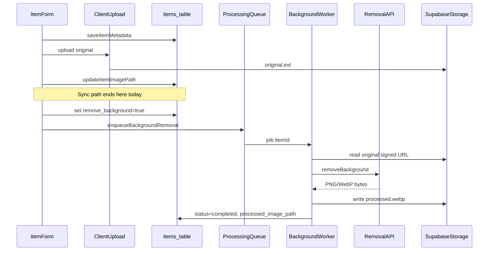

# Image Processing

Architecture for optional per-item background removal. **Not implemented yet** — this doc and the service layer describe how a future worker and external API will integrate without changing the current upload flow.

See also [storage.md](./storage.md) for bucket setup and path conventions, and [database-schema.md](./database-schema.md) for column definitions.

## Where Background Removal Fits

The current upload flow ends after the original image is stored. Background removal is a **separate async step** that runs only when the user opts in.



### Synchronous (unchanged)

These steps stay in the browser/server action path and block the user until complete:

1. Save item metadata (`saveItemMetadata`)
2. Validate and resize image on the client
3. Upload original to `{userId}/{itemId}/original.{ext}`
4. Set `items.image_path` (`updateItemImagePath`)
5. Redirect to `/wardrobe`

The user always gets a usable item with the original photo when the sync path succeeds.

### Asynchronous (future)

After the original exists and `remove_background = true`:

1. `enqueueBackgroundRemoval(itemId)` adds a job to a queue (not built yet)
2. A worker picks up the job, sets status to `processing`
3. Worker reads the original via signed URL, calls `BackgroundRemovalProvider.removeBackground()`
4. Worker writes `{userId}/{itemId}/processed.webp` to Storage
5. Worker sets `processed_image_path`, status `completed`, clears error

The user is not blocked during processing. The wardrobe list shows the original until processing completes.

## Storage: Original vs Processed

| File | Storage path | DB column | Written by |
|------|--------------|-----------|------------|
| Original | `{userId}/{itemId}/original.{ext}` | `items.image_path` | Client upload (today) |
| Processed | `{userId}/{itemId}/processed.webp` | `items.processed_image_path` | Background worker (future) |

- `image_path` always points at the **original** — never renamed to avoid breaking existing data.
- Processed files use a fixed WebP path via `buildItemProcessedPath()` in [`src/lib/storage/paths.ts`](../src/lib/storage/paths.ts).
- Replacing or removing the original clears processed metadata and deletes stale `processed.webp`.
- Deleting an item removes the entire `{userId}/{itemId}/` folder (both files).

## Display Resolution

[`resolveDisplayImagePath()`](../src/lib/image-processing/resolve.ts) picks which path to sign for UI:

- If `remove_background` is true **and** status is `completed` **and** `processed_image_path` is set → use processed
- Otherwise → use original (`image_path`)

While status is `pending`, `processing`, or `failed`, the UI falls back to the original so items remain usable.

## Processing Status

| Status | Meaning | Display | Notes |
|--------|---------|---------|-------|
| `none` | No processing requested | Original | Default when `remove_background = false` |
| `pending` | Queued, not started | Original | Set when opt-in enabled and job queued |
| `processing` | Worker running | Original | Prevents duplicate jobs |
| `completed` | Processed file ready | Processed (if opted in) | `processed_image_path` set |
| `failed` | Last attempt failed | Original | `image_processing_error` available for UI |

Supporting columns on `items`:

- `image_processing_attempts` — incremented each run; stop after `MAX_PROCESSING_ATTEMPTS` (3)
- `image_processing_error` — last failure message
- `image_processing_updated_at` — last status change; useful for retry backoff

### Retries and Failure

On failure, the worker calls `markProcessingFailed()`:

- Set status to `failed`
- Store error message
- Increment `image_processing_attempts`

Retry policy (future):

- Manual or scheduled retry resets status to `pending` if attempts < `MAX_PROCESSING_ATTEMPTS`
- After max attempts, status stays `failed`; user sees original and optional error/retry UI
- Replacing the original resets attempts, clears error, and deletes stale processed file

On original replace or image removal, `resetImageProcessingState()` clears processed fields so stale outputs are never shown.

## Optional Per Item

Background removal is **opt-in per item** via `remove_background` (default `false`):

- `false` — skip queueing; always display original; status stays `none`
- `true` — after upload, queue processing; display processed when complete

No global toggle. Future UI: checkbox on create/edit form that sets this flag and calls `enqueueBackgroundRemoval()` after upload.

## Service Layer (stub)

Code lives under [`src/lib/image-processing/`](../src/lib/image-processing/):

| File | Purpose |
|------|---------|
| `types.ts` | `ImageProcessingStatus`, `BackgroundRemovalProvider` interface |
| `constants.ts` | `MAX_PROCESSING_ATTEMPTS`, processed MIME type |
| `resolve.ts` | `resolveDisplayImagePath()` — pure display logic |
| `service.ts` | Stub orchestration: reset state, enqueue placeholder, mark completed/failed |

### Future integration points

**Provider interface** — swap implementations without changing the worker:

```ts
interface BackgroundRemovalProvider {
  removeBackground(input: BackgroundRemovalInput): Promise<BackgroundRemovalResult>;
}
```

**Enqueue** — `enqueueBackgroundRemoval(itemId)` currently returns `{ queued: false, reason: "not_implemented" }`. Replace with queue client (Supabase Edge Function, Inngest, etc.).

**Worker entrypoint** — not built yet. Will:

1. Load item, verify `remove_background` and original path
2. Call provider, upload result to `processed.webp`
3. Call `markProcessingCompleted()` or `markProcessingFailed()`

No external API or npm package is wired in this milestone.

## Migrations

Apply [`supabase/migrations/20260314000004_image_processing.sql`](../supabase/migrations/20260314000004_image_processing.sql) after storage migration:

```bash
supabase db push
```

## Manual Test Checklist (when implemented)

- [ ] Opt-in item shows original while pending/processing
- [ ] Completed item shows processed image in grid and edit page
- [ ] Failed item shows original with error available
- [ ] Replace original clears processed file and resets status
- [ ] Opt-out item never queues processing
- [ ] Retry respects max attempts
