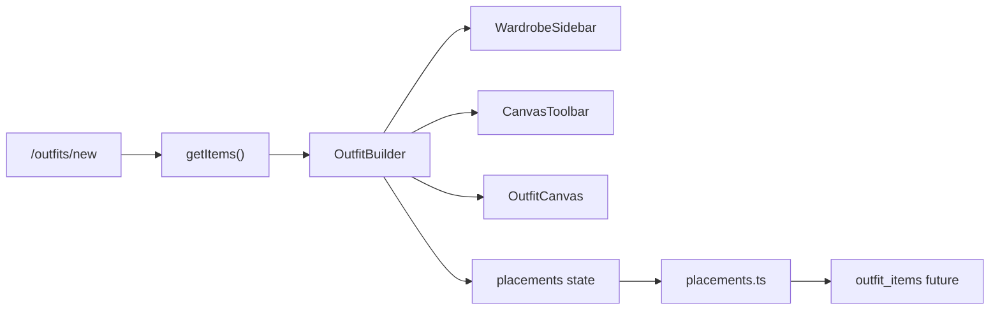

# Outfit Builder

Minimal outfit composition MVP using [Konva](https://konvajs.org/) via `react-konva`. See [canvas-tech-decision.md](./canvas-tech-decision.md) for library rationale.

**Save/load to Postgres is not implemented yet.** Canvas state lives in React; mapper functions in `src/lib/canvas/placements.ts` are ready for a follow-up milestone.

## Routes

| Route | Access | Purpose |
|-------|--------|---------|
| `/outfits` | Authenticated | Landing page with link to builder |
| `/outfits/new` | Authenticated | Outfit canvas editor |

Unauthenticated users are redirected to `/login` via middleware.

## User Interactions

1. Open **Build outfit** from `/outfits` or go directly to `/outfits/new`
2. **Click** a wardrobe thumbnail in the sidebar to add it to the canvas (one instance per item)
3. **Click** an image on the canvas to select it
4. **Drag** to reposition
5. Use corner handles to **resize**; use the rotation handle to **rotate**
6. **Bring forward** / **Send backward** to adjust layer order
7. **Delete** removes the selected item from the canvas
8. **Export PNG** downloads the current composition (selection cleared first)
9. Click empty canvas area to deselect

## Architecture



### Module map

| Path | Role |
|------|------|
| [`src/app/outfits/new/page.tsx`](../src/app/outfits/new/page.tsx) | Server page: auth, fetch wardrobe items with photos, dynamic import builder |
| [`src/components/canvas/OutfitBuilder.tsx`](../src/components/canvas/OutfitBuilder.tsx) | Client shell: state, sidebar/toolbar/canvas wiring |
| [`src/components/canvas/OutfitCanvas.tsx`](../src/components/canvas/OutfitCanvas.tsx) | Konva Stage, Layer, Transformer |
| [`src/components/canvas/CanvasImageNode.tsx`](../src/components/canvas/CanvasImageNode.tsx) | Draggable/resizable wardrobe image node |
| [`src/components/canvas/WardrobeSidebar.tsx`](../src/components/canvas/WardrobeSidebar.tsx) | Click-to-add wardrobe grid |
| [`src/components/canvas/CanvasToolbar.tsx`](../src/components/canvas/CanvasToolbar.tsx) | Layer, delete, export controls |
| [`src/lib/canvas/placements.ts`](../src/lib/canvas/placements.ts) | Default placement, z-index helpers, DB mappers |
| [`src/lib/canvas/loadImage.ts`](../src/lib/canvas/loadImage.ts) | Load images with `crossOrigin` for export |
| [`src/lib/canvas/export.ts`](../src/lib/canvas/export.ts) | `stage.toDataURL()` download helper |
| [`src/lib/types/outfit.ts`](../src/lib/types/outfit.ts) | `CanvasItemPlacement`, `WardrobeCanvasItem` |

## Canvas state ↔ database (future save/load)

Runtime state uses `CanvasPlacementState`:

```ts
{ itemId, x, y, scale, rotation, zIndex }
```

Maps to `outfit_items` columns:

| State field | DB column |
|-------------|-----------|
| `itemId` | `item_id` |
| `x` | `position_x` |
| `y` | `position_y` |
| `scale` | `scale` |
| `rotation` | `rotation` |
| `zIndex` | `z_index` |

**Save (future):** call `toCanvasItemPlacements(placements)` → upsert via server action.

**Load (future):** fetch `outfit_items` rows → `fromOutfitItemRows(rows, wardrobeItems)` → hydrate builder state and preload images.

## Dependencies

```bash
npm install konva react-konva
```

Canvas components use `dynamic(..., { ssr: false })` because Konva requires the browser DOM.

## Export notes

- Images load with `crossOrigin = 'anonymous'` so `toDataURL()` is not tainted
- If export produces a blank or blocked image, verify Supabase Storage CORS allows your app origin
- Transformer handles are hidden before export by clearing selection

## Manual QA Checklist

- [ ] `/outfits` redirects to `/login` when signed out
- [ ] `/outfits/new` shows wardrobe sidebar and blank canvas
- [ ] Sidebar lists only items with photos
- [ ] Click wardrobe item adds it to canvas center
- [ ] Same item cannot be added twice (button disabled after placed)
- [ ] Click canvas item selects it (stroke visible)
- [ ] Click empty canvas deselects
- [ ] Drag moves selected item
- [ ] Corner handles resize item uniformly
- [ ] Rotation handle rotates item
- [ ] Bring forward swaps layer with item above
- [ ] Send backward swaps layer with item below
- [ ] Delete removes selected item from canvas
- [ ] Export PNG downloads file with all visible items
- [ ] Export PNG does not include transformer handles
- [ ] Page works at tablet width (~768px)
- [ ] Empty wardrobe shows helpful message (no photos)

## Deferred

- Save outfit name and load saved outfits
- `/outfits/[id]` edit route
- HTML drag-from-sidebar
- Undo/redo, layers panel, snap-to-grid
- Processed (background-removed) images on canvas
