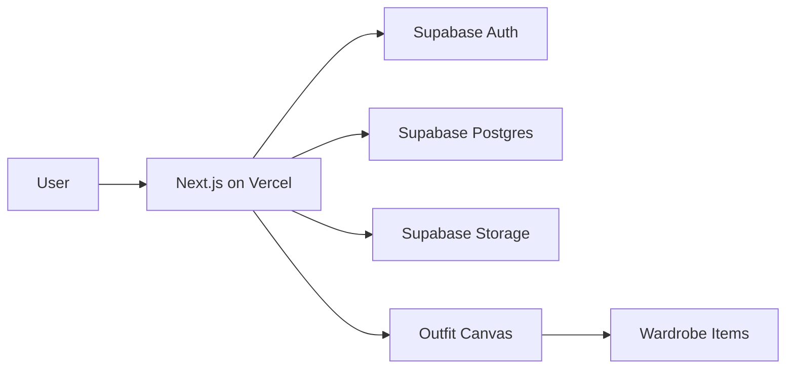

# Product Definition

## Product Goal

Garde-robe is a personal wardrobe manager that helps users see what they own and compose outfits visually. Users catalog clothing, accessories, and jewelry with photos and metadata, then drag items onto a blank canvas to build and save looks.

## Target User

- An individual managing their own wardrobe — not stylists, retailers, or inventory systems
- Uses a phone for quick item adds and browsing; uses desktop or tablet for outfit composition
- Prefers visual organization over spreadsheets or notes apps

## Primary User Flows

### 1. Add Item

1. Open the add-item form
2. Upload a photo (camera or file picker)
3. Enter metadata: name, category, color, brand, season/occasion tags
4. Save — item appears in the wardrobe

### 2. Browse Wardrobe

1. View all items in a grid or list
2. Filter by category, color, or season/occasion
3. Tap an item to view or edit details

### 3. Build Outfit

1. Open the outfit canvas
2. Drag items from the wardrobe sidebar onto the blank canvas
3. Resize and reposition items to compose a look
4. Name and save the outfit

### 4. Manage Items

1. Open an existing item
2. Edit metadata or replace the image
3. Delete items no longer in the wardrobe

## Core Features

- Responsive UI for desktop and mobile
- Wardrobe CRUD for clothing, accessories, and jewelry
- Item metadata: name, category, color, brand, season/occasion tags
- One image per item, stored in Supabase Storage
- Visual outfit builder: blank canvas with drag-and-drop from a wardrobe sidebar
- Save and load named outfits
- Single-user auth — one private account per person

## Nice-to-Have Features

Deferred beyond v1:

- Background removal on upload
- Bulk import
- Wear history / "last worn" tracking
- Outfit sharing or public gallery
- AI styling suggestions
- Calendar or packing lists

## Risks and Technical Constraints

### Image Handling

- Mobile camera photos can be large; compress or resize on upload
- Storage costs scale with item count on Supabase
- Set reasonable file size limits and accepted formats

### Canvas on Mobile

- Drag-and-drop UX is harder on small touch screens
- May need a simplified mobile layout or tablet-first canvas experience
- Test touch interactions early in milestone 5

### Performance

- Large wardrobes mean many images to load; use lazy loading and thumbnails
- Canvas with many positioned items needs efficient rendering

### Background Removal

- If added later, requires a third-party API with cost and latency tradeoffs
- Should remain optional, not required for core flows

### Stack Constraints

- Frontend: Next.js (App Router) deployed on Vercel
- Backend: Supabase for auth, Postgres database, and file storage
- No custom server beyond Next.js API routes and Supabase client calls

