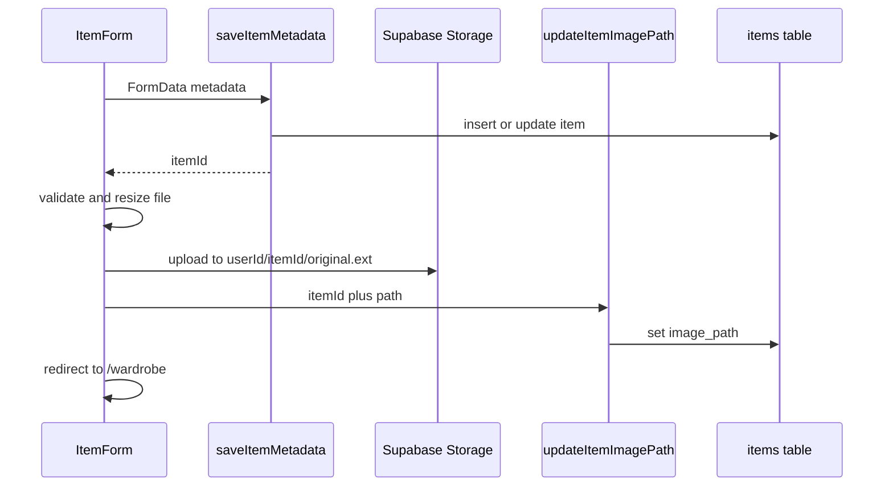

# Storage

Milestone 4 item image upload — private Supabase Storage bucket, client-side resize, signed URL display.

## Bucket Setup

Apply migration [`supabase/migrations/20260313000003_storage.sql`](../supabase/migrations/20260313000003_storage.sql) via Supabase SQL Editor or:


```bash
supabase db push
```

The migration creates:

| Setting | Value |
|---------|-------|
| Bucket ID | `item-images` |
| Public | No (private) |
| Max file size | 5 MB |
| Allowed MIME types | `image/jpeg`, `image/png`, `image/webp` |

You can also verify in **Supabase Dashboard → Storage** that the bucket exists and is private.

## Path Convention

Files are stored under the authenticated user's folder:

```
{userId}/{itemId}/original.{ext}
```

Examples:

- `a1b2c3…/item-uuid/original.jpg`
- `a1b2c3…/item-uuid/original.webp`

A processed variant can be written alongside the original without changing the upload flow:

```
{userId}/{itemId}/processed.webp
```

See [image-processing.md](./image-processing.md) for background removal architecture, status tracking, and display rules.

Helpers live in [`src/lib/storage/paths.ts`](../src/lib/storage/paths.ts). Validation constants are in [`src/lib/storage/image-validation.ts`](../src/lib/storage/image-validation.ts).

## Row Level Security

Storage RLS policies restrict access to objects whose first path segment matches `auth.uid()`:

- **SELECT** — read own files (signed URLs)
- **INSERT** — upload to own folder
- **UPDATE** — replace own files
- **DELETE** — remove own files

User A cannot read or write paths under User B's `{userId}/` prefix.

## Upload Flow



1. **Save metadata** — `saveItemMetadata()` creates or updates the item (no redirect)
2. **Client upload** — validate (5 MB, allowed types) → resize (max 1200px longest edge) → upload via browser Supabase client
3. **Update path** — `updateItemImagePath()` sets `items.image_path`; deletes previous file if replaced
4. **Delete item** — `deleteItem()` removes all objects under `{userId}/{itemId}/`

## Display

Server queries resolve the display path via `resolveDisplayImagePath()` then sign it with `getItemImageUrl()` in [`src/lib/storage/images.ts`](../src/lib/storage/images.ts). URLs are passed to `ItemImage` on the wardrobe grid and edit page. Today all items use the original; see [image-processing.md](./image-processing.md) for processed image rules.

`next.config.ts` allows Supabase storage hostnames for `next/image`.

## Environment Variables

Same as auth — no extra storage keys:

| Variable | Purpose |
|----------|---------|
| `NEXT_PUBLIC_SUPABASE_URL` | Supabase project URL |
| `NEXT_PUBLIC_SUPABASE_PUBLISHABLE_KEY` | Anon/publishable key (RLS enforced) |

Do not use the service role key in client code.

## Troubleshooting

| Issue | Check |
|-------|-------|
| Upload fails with policy error | Migration applied; user signed in; path starts with their user ID |
| Image missing in list | `items.image_path` set; bucket private — use signed URL, not public URL |
| "Image must be 5 MB or smaller" | Client validation before resize; bucket also enforces 5 MB |
| `next/image` error | Supabase hostname in `next.config.ts` `images.remotePatterns` |
| Old image after replace | `updateItemImagePath` deletes previous path when it changes |

## Manual Test Checklist

- [ ] Bucket + RLS migration applied
- [ ] Create item with JPEG → image shows in wardrobe grid
- [ ] Edit item → replace image → new image displayed
- [ ] Edit page shows larger preview
- [ ] Reject file over 5 MB or wrong type with clear error
- [ ] Loading states visible during save/upload
- [ ] Delete item removes image from storage
- [ ] User B cannot access User A's storage paths
