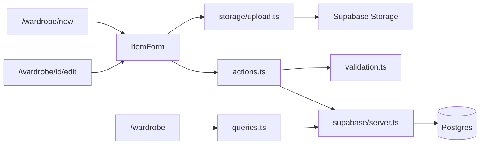

# Wardrobe Feature

Milestone 3 wardrobe CRUD plus Milestone 4 image upload — list, create, edit, delete, filter, and photos. See [database-schema.md](./database-schema.md) for table details and [storage.md](./storage.md) for image upload setup.

## Routes

| Route | Access | Purpose |
|-------|--------|---------|
| `/wardrobe` | Authenticated | Item list with filters |
| `/wardrobe/new` | Authenticated | Create item |
| `/wardrobe/[id]/edit` | Authenticated | Edit, preview, or delete item |

Unauthenticated users are redirected to `/login` via middleware.

## Item Fields

| Field | Required | Storage |
|-------|----------|---------|
| Name | Yes | `items.name` |
| Type | Yes | `items.item_type` (`clothing`, `accessory`, `jewelry`) |
| Category | Yes | Existing `categories` row or inline create |
| Color | No | `items.color_id` → global `colors` |
| Brand | No | Existing `brands` row or inline create |
| Seasons | No | `item_seasons` junction |
| Occasion tags | No | `items.occasion_tags` (comma-separated) |
| Notes | No | `items.notes` |
| Photo | No | `items.image_path` → Supabase Storage (`item-images` bucket) |

## Image Upload

Optional photo on create and edit:

1. Metadata saved via `saveItemMetadata` server action
2. Client validates, resizes (max 1200px), and uploads to `{userId}/{itemId}/original.{ext}`
3. `updateItemImagePath` stores the path and removes the previous file if replaced

List cards and the edit page show signed URLs resolved in [`src/lib/wardrobe/queries.ts`](../src/lib/wardrobe/queries.ts).

## Filters

Query params on `/wardrobe`:

- `category` — category UUID
- `color` — color UUID
- `season` — season UUID
- `brand` — brand UUID

Filters are applied server-side in [`src/lib/wardrobe/queries.ts`](../src/lib/wardrobe/queries.ts).

## Data Flow

- **Read:** Server Components call query helpers; signed image URLs attached per item
- **Write:** Metadata via server actions; image upload from client after item ID exists
- **Delete:** Server action deletes storage folder and item (cascades `item_seasons`)

## Key Files

| File | Role |
|------|------|
| `src/lib/wardrobe/queries.ts` | Fetch items, lookups, signed image URLs |
| `src/lib/wardrobe/actions.ts` | saveItemMetadata, updateItemImagePath, deleteItem |
| `src/lib/storage/upload.ts` | Client validate, resize, upload |
| `src/components/wardrobe/ItemForm.tsx` | Create/edit form with upload orchestration |
| `src/components/wardrobe/ItemImage.tsx` | Image with placeholder fallback |
| `src/components/wardrobe/ItemCard.tsx` | Grid card with photo |

## Manual Test Checklist

- [ ] `/wardrobe` redirects to `/login` when signed out
- [ ] Create item with photo → image appears in list
- [ ] Edit item → replace photo → new image shown
- [ ] Delete item → removed from list and storage
- [ ] Filter by category, color, season, and brand each narrow results
- [ ] Reject invalid or oversized images with clear errors
- [ ] Layout works at 375px width
